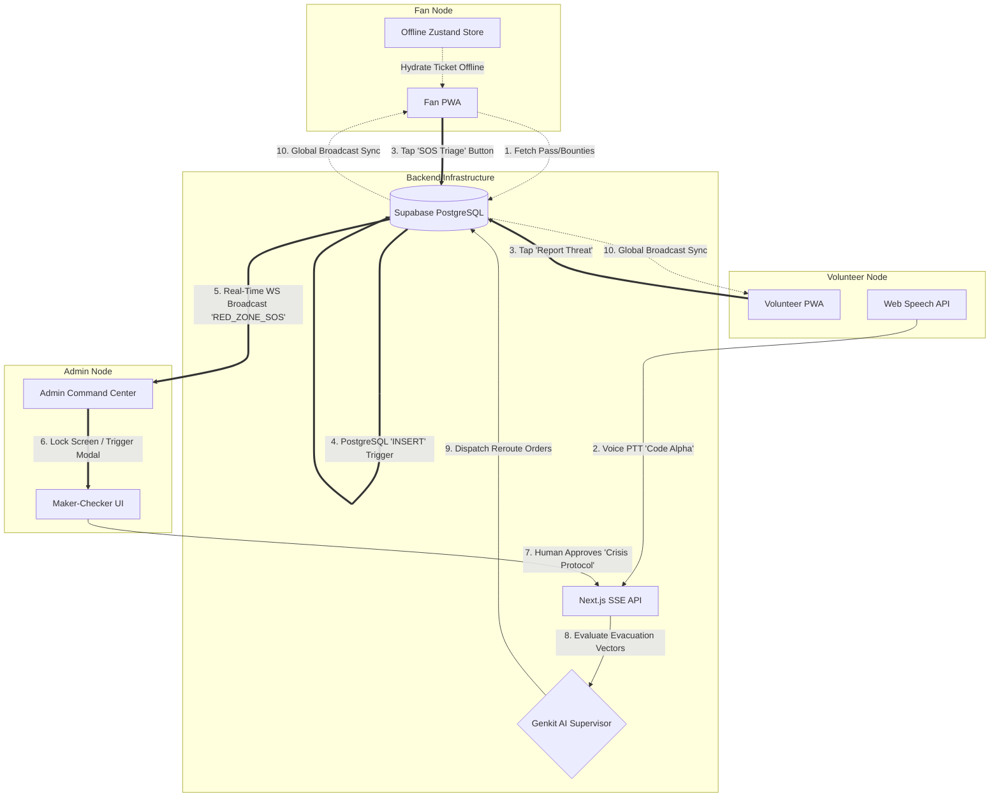

# 🛡️ Project Aegis

**Predictive Crowd Safety. Zero-Trust Operations.**

*A military-grade, Genkit-powered orchestrator designed to eliminate manual estimation and actively prevent kinetic crowd shockwaves before they occur.*

---

## 📖 The Catalyst: Solving the Manual Gap
The evolution of urban stadium security has reached a critical inflection point. Traditional, manually-driven crowd control paradigms are reactive and linear, often failing catastrophically in dynamic environments. 

The tragic events following the RCB IPL Victory Celebration in Bengaluru on **June 4, 2025**—where an abrupt parade cancellation funneled an unmanaged mass of fans into a static stadium perimeter—served as a stark baseline for structural failure. **Aegis** was born to ensure this never happens again.

By replacing VHF radio silos and visual density estimation with **hard numerical capacity caps** and **autonomous AI load balancing**, Aegis transforms stadiums from unmanageable pressure cookers into predictable, fluid ecosystems.

---

## 📊 The Statistics of the "Manual Gap"
Crowd crushes are not random anomalies; they are the mathematical consequence of human operators failing to accurately judge spatial density before it crosses the threshold of fluid dynamics. 

### A Decade of Stadium Disasters in India (2016-2026)
Empirical data from the past decade highlights the lethality of relying on physical barricades and delayed reactive policing:

| Date | Venue / Location | Trigger / Root Cause | Casualties |
| :--- | :--- | :--- | :--- |
| **June 4, 2025** | M. Chinnaswamy Stadium, Bengaluru | Unplanned diversion of RCB Victory Parade to stadium gates | **11 Dead, 56 Injured** |
| **Sept 22, 2022** | Gymkhana Grounds, Hyderabad | 30,000 fans surging for 3,000 offline T20 tickets | **20+ Injured** |
| **March 19, 2022** | Poongod Stadium, Kerala | 5,000 spectators in a 2,000-capacity makeshift gallery | **200+ Injured** |
| **March 22, 2021** | Police Grounds, Suryapet | Gallery collapse under kinetic weight of overcapacity crowd | **80+ Injured** |
| **April 20, 2025** | Kothamangalam, Kerala | Structural failure during dynamic trophy procession | **21 Injured** |

### The Physics of a Crush
The transition from a safe crowd to a fatal crush is governed by exact density thresholds:
* **1-2 persons/m²:** Safe operating condition. Individuals maintain physical autonomy and walking velocity.
* **4-5 persons/m²:** Critical restricted movement.
* **> 6 persons/m² (Lethal Threshold):** The crowd ceases to be independent actors and becomes a **continuous fluid mass**. Individual autonomy is lost. Kinetic shockwaves ripple through the crowd, generating multi-directional compressive forces often exceeding **4,000 Newtons**. 
* **Mechanism of Death:** Victims primarily die from **compressive asphyxia** (inability to expand the lungs due to external pressure), not blunt force trauma from trampling.

---

## 🛡️ How Project Aegis Prevents Deaths

To prevent these tragedies, Project Aegis completely bridges the "Manual Gap"—the fatal delay between a dangerous density spike and a human administrative response. We achieve this through predictive inference and autonomous agentic action.

### 1. Eliminating Human Visual Estimation
Human security personnel cannot neurologically distinguish a crowd at 3 persons/m² from a crowd at 6 persons/m² on a CCTV feed until a panic scatter begins. Aegis utilizes **AI Spatial Density Calculation (CSRNet + 3D LiDAR data ingestion)** to provide an exact, mathematically perfect, real-time density metric, identifying localized bottlenecks 5-12 minutes before they become visible to the human eye.

### 2. Algorithmic Preemption (The Vanguard Protocol)
Instead of waiting for a density threshold to reach 6 persons/m², the Genkit Supervisor initiates **"Trend Alerts"**. If the AI detects that Gate 7's incoming pedestrian volume will breach the 4.5 persons/m² safety limit in 10 minutes, it deploys the Vanguard Protocol. The system automatically pushes gamified digital bounties to Fans' mobile passes, actively rerouting traffic to underutilized gates and bleeding off compressive pressure before the choke point forms.

### 3. Autonomous Maker-Checker Triage
When traditional VHF radio silos fail, Aegis acts instantly. If a Volunteer triggers the "Command Code Alpha" Voice PTT due to sudden structural instability, the AI instantly halts all incoming digital traffic. It locks down the Admin Dashboard, drafts an immediate SOS routing map, and proactively alerts relevant authorities (Rapid Action Medical Teams, Police, and local emergency response) with exact spatial coordinates. It forces the Human Admin to make a definitive "Approve/Override" decision, entirely bypassing bureaucratic communication latency.

---

## ⚡ Core Architecture

Project Aegis is a zero-trust, multi-agent spatial operating system built on a unified **Next.js 15 Next-PWA** architecture.

### 🧠 The Genkit Supervisor
Powered by **Firebase Genkit** and **Vertex AI (Gemini 1.5 Pro & Gemini 3.5 Flash)**, the Supervisor acts as the central brain. It ingests high-frequency density data from Supabase Realtime and executes a Maker-Checker escalation matrix. We enforce strict explicit context caching to eliminate token bloat during 60fps telemetry streaming.

### 📡 The Vanguard Protocol (Fan PWA)
Fans authenticate via Google OAuth to access their digital ticket. Aegis utilizes **Zustand + idb-keyval** to ensure tickets survive offline 4G network dropouts. The AI proactively load-balances foot traffic by sending dynamic rerouting bounties (gamification credits) to Fans in dense (Orange) zones.

### 🎙️ Action Node (Volunteer PWA)
Volunteers bypass complex UI under stress. Using the **Web Speech API** bound to a physical Push-to-Talk (PTT) interface, volunteers issue vocal directives (e.g., *"Command Code Alpha: Gate 7 Red"*), instantly triggering AI triage protocols.

### 🗺️ Command Center (Admin Glass Backend)
Admins monitor the stadium via a dark-mode **Framer Motion SVG map** that interpolates density percentages into Hex Colors (`Green -> Yellow -> Orange -> Red`). The "Glass Backend" streams the AI's internal reasoning (thought logs) in real-time via Server-Sent Events (SSE).

---

## 🌊 Architecture & Data Flows

Aegis operates on a strict event-driven, bi-directional WebSocket architecture to ensure zero latency during kinetic threat escalations.

### Request Flow & Threat Alert Sequence

### 1. Data Flow (Vanguard Protocol)
1. **Ingestion**: Hardware nodes (or mock streaming scripts) `UPSERT` crowd densities directly into `stadium_blocks`.
2. **Analysis**: Genkit Supervisor continuously evaluates if a gate density breaches 75%. 
3. **Action**: It inserts a Gamification Bounty targeting fans at that gate to reroute them for points.
4. **Delivery**: Supabase pushes the new `vanguard_bounties` row to the Fan PWA via Realtime WebSockets.

### 2. Critical Threat Alert Flow (Zero-Trust SOS)
1. **Trigger**: A Fan hits "SOS" or a Volunteer taps "Report Threat".
2. **Audit Logging**: The frontend immediately `INSERT`s an immutable `RED_ZONE_SOS` record into the `event_logs` table.
3. **Real-Time Override**: Supabase broadcasts the `event_logs` insert to the Admin Command Center in milliseconds.
4. **Maker-Checker Wall**: The Admin UI instantly locks down. The Human Admin must review the AI's drafted SOS message and click "Approve Crisis Protocol."
5. **Bi-Directional Broadcast**: Upon approval, the Admin pushes a `ZONE_WARNING` broadcast back to the `event_logs` table, which instantly renders as a highly-visible Alert Toast on all Fan and Volunteer devices.

---

## 🛠️ Tech Stack Matrix

| Layer | Framework / Version | Justification |
| :--- | :--- | :--- |
| **Core Framework** | Next.js 15 (App Router) | Edge-compatible API routes for zero cold-start SSE streaming. |
| **Auth & Database** | Supabase (`@supabase/ssr`) | JWT-based Zero-Trust RBAC. WebSockets natively broadcast crowd density spikes. |
| **State Management**| Zustand + `idb-keyval` | Handles transient UI state and persists digital tickets offline. |
| **AI Orchestration** | Firebase Genkit + Vertex AI | Supervisor-Worker pattern using Gemini 1.5 Pro. |
| **UI & Motion** | Tailwind v4 + Framer Motion | Binds natively to SSE events to orchestrate the SVG Map color interpolation smoothly. |
| **PWA Engine** | `@serwist/next` | Aggressively caches static assets for standalone mobile home screen installation. |

---

## 🎨 Deterministic Design System (OKLCH)
Aegis employs a strict **OKLCH color space** to ensure mathematically perfect contrast ratios (WCAG 2.1 AA compliant) for outdoor readability and low-light operations. 

- **Human UI:** `Geist Sans` for clear, readable standard interfaces.
- **Agent Telemetry:** `Geist Mono` for precise event logs, data tables, and AI thought streams.
- **Aesthetics:** Deep Space Tactical Dark Mode (`oklch(0.13 0.01 285)`), featuring 64px backdrop blurs and subtle 3% noise overlays for a premium, zero-trust glassmorphism feel.

---

## 🚀 Execution & Deployment
Aegis is configured for seamless deployment to **Firebase App Hosting**. 

### The 4-Tier Agentic Workflow
1. **Load-Balancing Loop:** The Node.js Mock Engine pushes density updates (`GATE_7: 85%`). Supabase Realtime triggers the Next.js API. The Genkit Supervisor evaluates and issues Vanguard Bounties to reroute traffic to `GATE_4`.
2. **Voice-Steered Code Red:** A Volunteer triggers *"Command Code Alpha"*. The AI halts autonomous routing and drafts an SOS.
3. **Maker-Checker Pause:** The Admin UI locks down, displaying the AI's drafted SOS. A human Admin must physically click "APPROVE" to execute the closure.
4. **Audit Trail:** Every action, AI evaluation, and Admin override is permanently recorded in the `event_logs` table.

---

  <i>"Aegis ensures that human intervention is reserved for strategy, while execution is handled by mathematics."</i>

